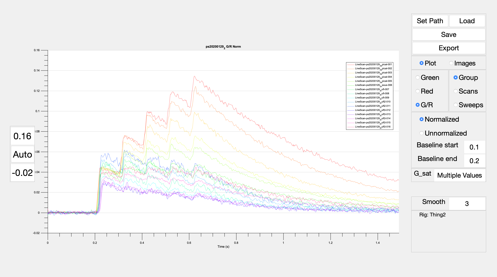
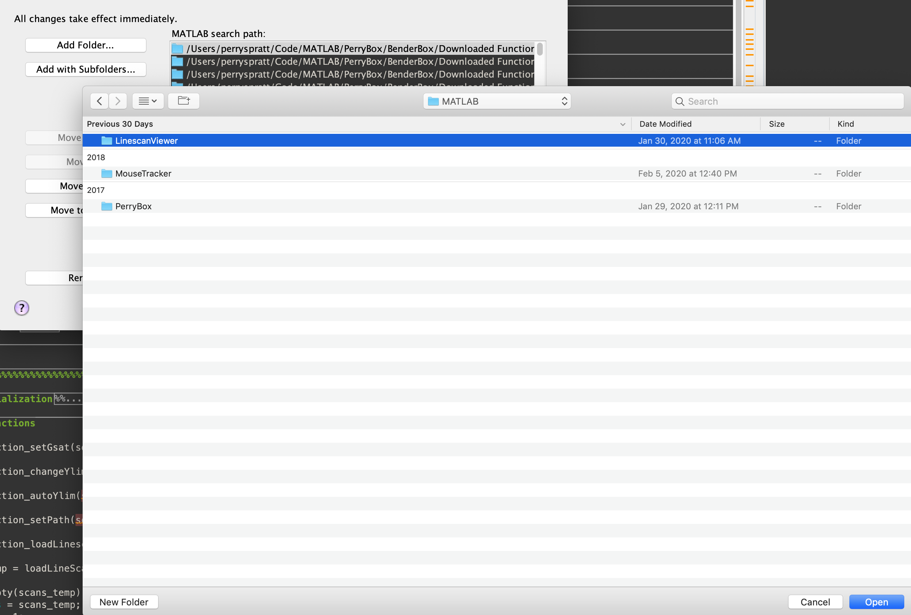
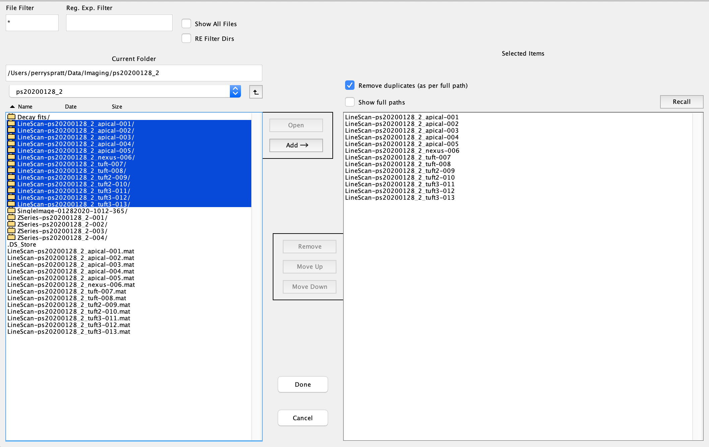
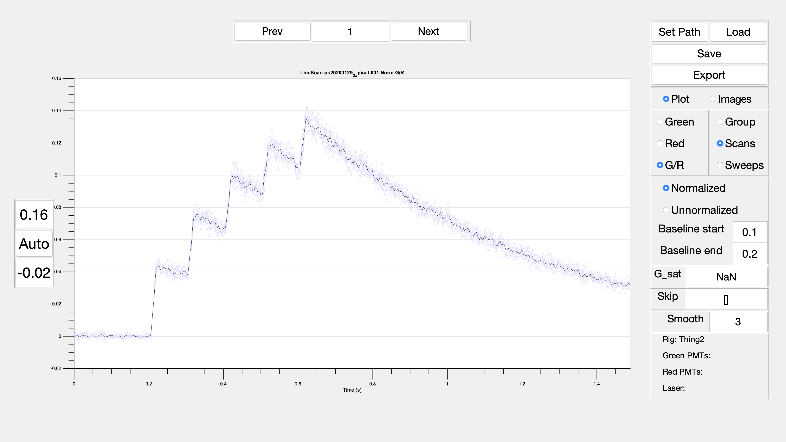
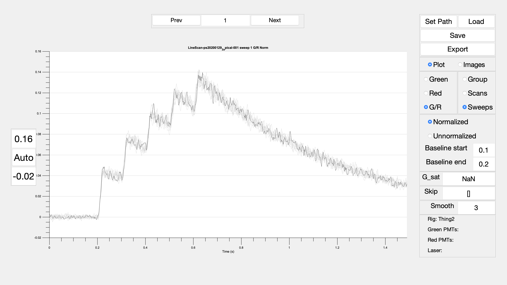
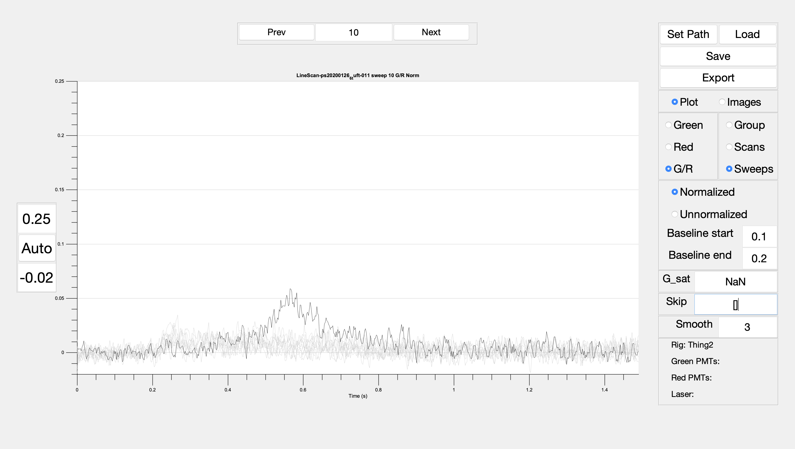
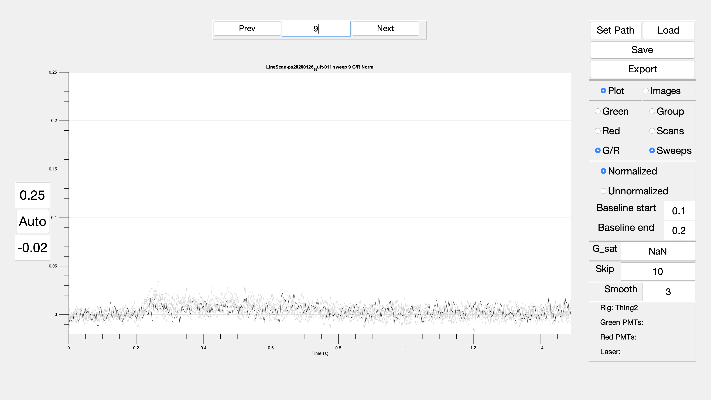
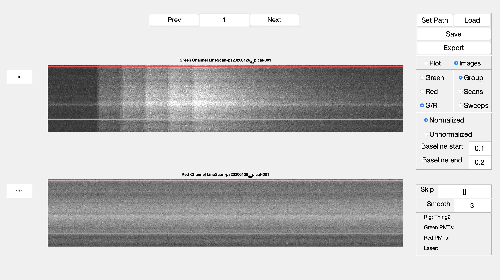

# linescanViewer

linescanViewer is a matlab tool box that allows for visualizating linescan data generated in the [Bender Lab](https://benderlab.ucsf.edu/) from Pairieview

## Setup
To get started with linescanViewer, download or clone the repository to your local system and add the toolbox to your matlab path making sure to add with subfolders and pressing save

Type linescanViewer into the command window to launch the user interface

## Loading linescans
linescanViewer is able to load both raw linescan folders generated by prairie and linescan.mat files generated by linescanViewer

Start by first setting your MATLAB path to a folder containing linescan foldres/files by pressing "Set Path"

Next press "Load" to launch the loading window. Select the linescan folders and linescan.mat files you wish to analyze, press add, and then press done

If a linescan folder is selected it will automatically sort the image files within it into appropriately named directories

## Viewing linescan data
linescanViewer allows multiple ways of visualizing linescan data

### Viewing linescan plots
Selecting the "Plot" radio button displays a plot of signal vs time

To view different  color channels, select either the "Green", "Red", or "G/R" radio buttons  

Selecting the "Group" radio button displays all of the linescans currently loaded into linescanViewer

Selecting "Scans" displays all of the data from a single linescan. This reveals "Next" and "Previous" buttons above the graph that allow switching between loaded linescans

Selecting "Sweeps" displays individual sweeps from a linescan file

Date can be displayed as "Normalized" (∆F/F for red and green channels, ∆G/R for G/R) or "Unnormalized" (raw values). If "Normalized" is selected, the baseline period can be specified by changing the "Baseline start" and "Baseline end" text fields

Displayed data can be smoothed by entering a smoothing span into the "Smooth" text field

If a known G_sat value is known for the ∆G/R data, it can be entered into the G_sat text field and the displayed data will be updated appropriately

Occasionally, linescans will contain sweeps that have large artifacts or other issues that warrent their removal. These sweeps can be entered into the "Skip" text field and data from that sweep will no longer be included in the displayed plots. This does not delete the within the skipped sweep, it only hides it from the functions used to plot and analyze the data

### Viewing linescan images
Selecting "Images" will display the average raw image (if "Group" or "Scans" is selected) or the raw individual sweep image (if "Sweeps" is selected) of the red and/or green channels

The brightness of each channel can be changed by increasing or decreasing the values in the text fields to the left of the images (this only changes the displayed image, not the underlying data)

With either "Group" or "Scans" selected, red lines will appear that can be dragged to crop the region of the image that is quantified to make plots. Background regions containing no or limited signal should be restricted in this manner

## Saving
Once a linescan folder/file has been modified (by changing the baseline values, skipping scans or cropping), it can be saved for future analysis by pressing "Save". This will launch a save window to select a location for the saved linescans

Linescans are saved as ".mat" that can later be loaded by linescanViewer or directly into matlab. This allows edits to be preserved and for linescan data to be accessed outside of linescanViewer

## Figure export
Pressing "Export" will launch a save window that can save the displayed plot as either a png, fig, or eps file
